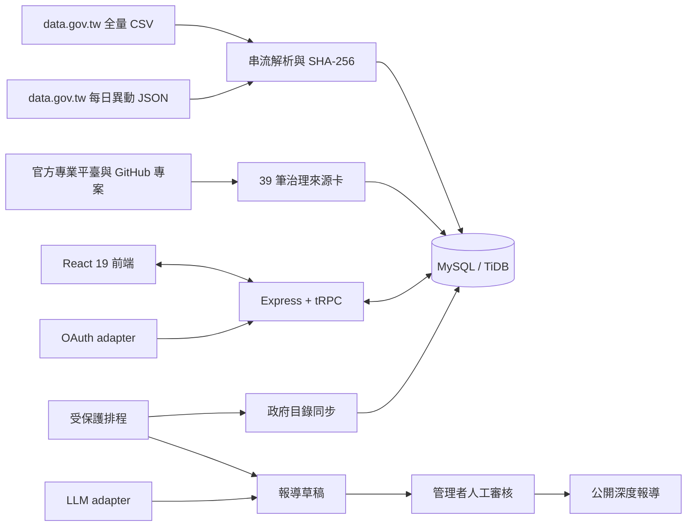

# PiSuODS｜PiSuAI 紫鳥貔貅・臺灣開放資料與深度報導平台

<p align="center">
  
</p>

[](https://opendataset.manus.space/)
[](https://kuohuafan.github.io/pisuai-open-data/)
[](./LICENSE)
[](./CONTRIBUTING.md)
[](https://github.com/KuohuaFan/pisuai-open-data/actions/workflows/ci.yml)


**PiSuODS**（PiSuAI Open Data System）是 PiSuAI 產品線中的臺灣開放資料平台，以來源追溯、再利用治理分類與人工發布閘門為核心。本 repository 所含的 PiSuODS 程式碼與技術文件以 MIT License 開放原始碼，歡迎 Fork、部署、提出 Issue、送出 Pull Request，或協助查核新的資料來源。系統將政府資料開放平臺的全國資料目錄轉化為可搜尋索引，同時維護一層經人工判讀的官方與民間來源庫。平台也能依已核准來源產生具引用的深度報導草稿；在官方服務中，AI 不得跳過人工審核直接發布。

**開源範圍聲明**：MIT License 僅及於本 repository 所含的 PiSuODS 程式碼與技術文件。PiSuAI 產品線的其他產品、未納入本 repository 的服務、模型、資料庫內容與品牌識別，均不因本聲明而一併授權。詳見[開源範圍與部署](#開源範圍與部署)及 [`TRADEMARKS_AND_DATA.md`](./TRADEMARKS_AND_DATA.md)。

完整全端網站（官方部署）：[https://opendataset.manus.space/](https://opendataset.manus.space/)

GitHub Pages 專案介紹：[https://kuohuafan.github.io/pisuai-open-data/](https://kuohuafan.github.io/pisuai-open-data/)

> **核心原則：來源可追、版本可核、權利先行、錯誤可改。** 收錄 metadata 不表示 PiSuODS 已驗證每筆原始資料，也不表示資料可以不受限制地重新利用。

## 參與開源專案

您可以 Fork 本專案建立自己的資料目錄搜尋與同步平台，也可以透過 Issue 與 Pull Request 改善 PiSuODS。開始前請閱讀 [`CONTRIBUTING.md`](./CONTRIBUTING.md)，並參考 [`ROADMAP.md`](./ROADMAP.md) 選擇可立即執行的優化項目。登入、AI 報導、通知與檔案服務等功能依賴外部 runtime，Fork 後需依[非 Manus 環境的復刻範圍](#非-manus-環境的復刻範圍)替換 adapter。

| 參與方式     | 適合內容                                         | 入口                                                                                                      |
| ------------ | ------------------------------------------------ | --------------------------------------------------------------------------------------------------------- |
| Fork 與部署  | 自建資料平台、替換品牌、串接自己的驗證或模型服務 | GitHub 的 **Fork** 按鈕                                                                                   |
| 錯誤回報     | 可重現的程式、介面、同步或文件錯誤               | [Bug report](https://github.com/KuohuaFan/pisuai-open-data/issues/new?template=bug_report.yml)            |
| 功能提案     | 搜尋、效能、架構、無障礙與部署改善               | [Feature proposal](https://github.com/KuohuaFan/pisuai-open-data/issues/new?template=feature_request.yml) |
| 資料來源提案 | 新增或修正臺灣官方、民間與 GitHub 資料來源       | [Data source proposal](https://github.com/KuohuaFan/pisuai-open-data/issues/new?template=data_source.yml) |
| 程式貢獻     | 程式碼、測試、文件、治理規則與可重現的效能改善   | [貢獻指南](./CONTRIBUTING.md)                                                                             |
| 安全通報     | 漏洞、憑證、未公開個資或可能造成資料外洩的問題   | [安全政策](./SECURITY.md)                                                                                 |

程式碼、上游資料與 PiSuAI 品牌並非同一組權利。公開部署 Fork 前，請閱讀 [`TRADEMARKS_AND_DATA.md`](./TRADEMARKS_AND_DATA.md)。

## 維護者與回應

本專案由 [`.github/CODEOWNERS`](./.github/CODEOWNERS) 所列維護者負責審查。Issue 與 Pull Request 以七個工作日內首次回應為目標；安全問題請勿公開建立 Issue，改依 [`SECURITY.md`](./SECURITY.md) 私密通報。專案決策流程見 [`GOVERNANCE.md`](./GOVERNANCE.md)。

## 目前規模

以下數字來自 2026 年 9 月 15 日的官方全量快照與專案驗證紀錄。政府資料集會隨上游目錄持續變動；完整 CSV 不進入 Git 歷史，可由官方 API、GitHub Release 或 GitHub Pages 衍生索引取得。（來源 1）

| 項目                | 已驗證項目說明         |      結果 |
| ------------------- | ---------------------- | --------: |
| 政府資料集 metadata | 匯入筆數               | 53,169 筆 |
| 唯一 datasetId      | ID 唯一性              | 53,169 個 |
| 提供機關標籤        | 欄位正規化後的不重複值 |    800 個 |
| 政府服務分類        | 欄位正規化後的不重複值 |     18 類 |
| 人工治理來源卡      | seed 內建筆數          |     39 筆 |
| 治理來源類別        | seed 內建類別數        |     20 類 |

「已驗證」指匯入筆數、ID 唯一性與欄位完整性通過專案測試，**不代表逐筆確認原始資料內容正確**。詳細驗證過程見 [`government-catalog-qa.md`](./government-catalog-qa.md)，已查核的政府資料入口與同步限制見 [`government-data-source-map.md`](./government-data-source-map.md)，開源發布時的稽核紀錄見 [`OPEN_SOURCE_RELEASE.md`](./OPEN_SOURCE_RELEASE.md)。

## 為什麼採兩層資料架構

PiSuODS 不把「出現在政府目錄」與「已完成法律及資料治理審查」混為一談。因此，平台將內容分成兩個層次。

| 層次             | 用途                                                                              | 公開判斷                                        |
| ---------------- | --------------------------------------------------------------------------------- | ----------------------------------------------- |
| **政府資料全集** | 保存 data.gov.tw 的資料集名稱、機關、格式、欄位、更新頻率、授權、官方頁與資源連結 | metadata 可搜尋；實際使用仍須回到原始資料與授權 |
| **治理來源庫**   | 保存官方專業平臺、地方資料平臺及重要民間開源專案的查核卡                          | 逐來源記錄治理分類、風險、顯名方式及公開政策    |

這個設計使平台可以提供廣泛的資料發現能力，同時避免對敏感資料、第三人內容或混合授權作過度概括。

## 主要功能

| 模組               | 功能                                                                                                         |
| ------------------ | ------------------------------------------------------------------------------------------------------------ |
| 政府資料全集       | 多關鍵字搜尋、服務分類篩選、分頁瀏覽、資料集詳情與官方資源導流                                               |
| 來源治理           | Canonical URL、GitHub repository、commit SHA、資料授權、程式碼授權及風險說明                                 |
| 五類再利用治理分類 | A 可公開再利用、B 僅索引與導流、C 限內部使用、D 另取授權、MIXED 逐欄審查；為平台內部判讀標籤，不取代原始授權 |
| 每日同步           | 全量 CSV 串流匯入、前一日 JSON 異動同步、datasetId 去重、雜湊與下架保留                                      |
| 深度報導           | 依已核准來源產生具引用草稿；證據不足時採安全降級，不自動發布                                                 |
| 會員功能           | OAuth 登入（官方部署使用 Manus OAuth）、來源收藏及報導收藏                                                   |
| 治理後台           | 來源狀態、治理分類、公開範圍、報導核准、管線紀錄與同步操作                                                   |
| 稽核能力           | 記錄資料同步結果、來源變更與管理者操作                                                                       |

## 系統架構



前端只透過型別安全的 tRPC 程序讀寫資料。排程端點使用 cron 身分驗證與 task UID 綁定，並設置六小時冪等窗口。正式資料庫、OAuth 憑證及模型金鑰不進入 Git repository。

## 技術棧

| 範圍     | 技術                                                                |
| -------- | ------------------------------------------------------------------- |
| 前端     | React 19、Vite 7、Tailwind CSS 4、shadcn/ui、Wouter、TanStack Query |
| API      | Express 4、tRPC 11、Zod 4、SuperJSON                                |
| 資料庫   | MySQL／TiDB、Drizzle ORM、Drizzle Kit                               |
| 驗證     | OAuth adapter（官方部署：Manus OAuth）、角色分級 `user`／`admin`    |
| 資料管線 | `csv-parse` 串流解析、SHA-256、批次 upsert、每日異動同步            |
| AI 報導  | LLM adapter（官方部署：Manus 內建 LLM）、來源約束提示與人工發布閘門 |
| 品質     | TypeScript、Vitest、正式 production build、桌機與手機視覺驗證       |

## 快速開始

### 最小路徑：只跑政府目錄搜尋與同步

依[環境變數](#環境變數)一節，只設定 `DATABASE_URL` 與 `JWT_SECRET` 即可啟動資料目錄搜尋與同步功能；登入、收藏、後台與 AI 報導在缺少對應變數時停用。這是 Fork 者驗證資料層最快的方式。

### 必要環境

請使用 **Node.js 22**、**pnpm 10**，並準備一個 MySQL 8 相容或 TiDB 資料庫。OAuth 與 LLM 功能需要相應的 adapter 環境變數。

```bash
git clone https://github.com/KuohuaFan/pisuai-open-data.git
cd pisuai-open-data
corepack enable
pnpm install
pnpm setup:env
```

編輯 `.env` 填入下一節所列的環境變數。完成後，套用既有 migration 並匯入治理來源卡：

```bash
pnpm exec drizzle-kit migrate
pnpm exec tsx scripts/seed.ts
pnpm dev
```

開發伺服器預設使用 `http://localhost:3000`。請勿把 `.env`、資料庫備份或 OAuth 憑證提交到 Git。

### 非 Manus 環境的復刻範圍

資料模型、政府目錄同步、治理來源、公開搜尋頁、報導資料結構與測試可以直接復用。官方部署的 OAuth、內建 LLM、通知與檔案服務由 Manus WebDev runtime 提供；部署到其他平臺時，需要替換 `server/_core/` 中對應的 adapter。本專案尚未提供非 Manus 的參考 adapter，這是 [`ROADMAP.md`](./ROADMAP.md) 列出的優先項目，歡迎貢獻。詳見 [`CONTRIBUTING.md`](./CONTRIBUTING.md)。

## 環境變數

| 變數                     | 用途                 | 必要性       |
| ------------------------ | -------------------- | ------------ |
| `DATABASE_URL`           | MySQL／TiDB 連線字串 | 必要         |
| `JWT_SECRET`             | Session cookie 簽章  | 必要         |
| `VITE_APP_ID`            | OAuth 應用程式 ID    | 登入功能必要 |
| `OAUTH_SERVER_URL`       | OAuth 伺服器網址     | 登入功能必要 |
| `VITE_OAUTH_PORTAL_URL`  | 前端登入入口         | 登入功能必要 |
| `OWNER_OPEN_ID`          | 初始管理者 Open ID   | 後台必要     |
| `OWNER_NAME`             | 站台擁有者顯示名稱   | 建議         |
| `BUILT_IN_FORGE_API_URL` | LLM 服務入口         | AI 功能必要  |
| `BUILT_IN_FORGE_API_KEY` | LLM 服務伺服器端金鑰 | AI 功能必要  |

本機 `.env` 已由 `.gitignore` 排除；`env.example` 只含變數名稱與說明，`pnpm setup:env` 會將其複製為 `.env`。正式機密應由部署平台的 secret manager 管理。

## 建立政府資料全集

### 三種取得方式

| 方式                    | 用途                                         | 入口                                                                                                  |
| ----------------------- | -------------------------------------------- | ----------------------------------------------------------------------------------------------------- |
| 官方全量匯出 API        | 取得 data.gov.tw 最新 CSV                    | `https://data.gov.tw/api/v2/rest/dataset/export`                                                      |
| GitHub Release snapshot | 取得具日期、SHA-256 與 manifest 的可重現快照 | [`catalog-2026-09-15`](https://github.com/KuohuaFan/pisuai-open-data/releases/tag/catalog-2026-09-15) |
| GitHub Pages 分層索引   | 依服務分類、機關及資料集瀏覽 metadata        | [`/catalog/`](https://kuohuafan.github.io/pisuai-open-data/catalog/)                                  |

### 全量匯入

官方全量目錄採 CSV 匯出。系統使用 RFC 4180 相容的串流 parser，並依 datasetId 批次 upsert。部分官方欄位可能超過 64 KB，因此 description、field description、下載連結及備註使用 `MEDIUMTEXT` 保存。

```bash
curl -L 'https://data.gov.tw/api/v2/rest/dataset/export' \
  -o /tmp/data-gov-tw.csv

pnpm exec tsx scripts/syncGovernmentCatalog.ts \
  full /tmp/data-gov-tw.csv
```

也可以直接下載 Release 的三個資產、驗證 SHA-256、解壓並匯入：

```bash
pnpm exec tsx scripts/syncGovernmentCatalog.ts \
  full --from-release catalog-2026-09-15
```

Release `manifest.json` 的 `snapshotDate` 與壓縮資產 `sha256` 會寫入 `government_catalog_syncs` 的 `reportDate` 與 `snapshotSha256`。若 manifest 的 `rowCount` 與實際匯入筆數不一致，CLI 會輸出警告供稽核。

### 每日異動

每日異動檔只接受明確標示為「資料集上架」、「資料集修改」或「資料集下架」的紀錄。缺少變動狀態的列會被排除，空欄位也不會覆蓋全量快照中既有的完整 metadata。

```bash
pnpm exec tsx scripts/syncGovernmentCatalog.ts \
  delta 2026-09-15
```

同步結果會寫入 `government_catalog_syncs`。重播同一份異動檔時，雜湊及狀態相同的紀錄不會再次被計為變更。

## 排程與發布閘門

系統提供兩個受保護的排程端點：

| 端點                                          | 預定用途                       | 安全控制                                      |
| --------------------------------------------- | ------------------------------ | --------------------------------------------- |
| `POST /api/scheduled/sync-government-catalog` | 每日同步前一日政府資料異動     | Cron 身分、task UID、啟用狀態及六小時冪等窗口 |
| `POST /api/scheduled/generate-report-draft`   | 依排程週期建立一則深度報導草稿 | 只建立待審草稿，不可直接公開                  |

這些端點不是公開 webhook。正式啟用時，必須由部署平台的受驗證排程服務呼叫，並把 task UID 寫入 `automation_configs`；正式部署目前未啟用這兩項排程；seed 預設 cron 為每兩日 01:00（臺北時間），啟用與否由 `automation_configs` 的 `enabled` 與部署平台排程決定。目錄同步可以 `scripts/syncGovernmentCatalog.ts` 手動執行。管理者亦可在治理後台使用「產生一則待審草稿」手動建立報導草稿。

**人工發布閘門的性質**：「AI 不得跳過人工審核直接發布」是本專案的預設實作與 PiSuODS 官方服務的營運政策，不構成對 MIT License 授權權利的額外限制。取得本專案程式碼的第三人依 MIT License 得修改此設計；但公開部署時，仍須自行承擔上游資料授權、個資與名譽風險。

## 資料治理與權利邊界

政府資料開放平臺目錄中的資料集授權並不完全相同。即使多數資料採政府資料開放授權條款第 1 版，仍可能存在 CC0、CC BY、CC BY-SA、OFL、付費內容、需申請服務或第三人權利。（來源 2）因此，PiSuODS 逐筆保存原授權，不把程式碼授權延伸到上游資料。

裁判、醫療、政治獻金、公司關係、不動產交易與行政裁罰等內容具有較高的個資、名譽或再識別風險。這些來源預設採索引、導流或逐欄審查，不因資料由政府機關提供就推定可以無限制散布。司法院、TDX 與智慧財產局等專業平臺也各有會員、速率、附件或使用條件。（來源 3、4、5）

## 測試與品質檢查

```bash
pnpm test -- --run
pnpm check
pnpm build
```

目前測試涵蓋品牌與 Logo 設定、OAuth 登出、首頁 SEO 限制、擴充來源唯一性、政府專業來源治理、資料欄位正規化、Release checksum、快照 provenance、分層索引唯一性、400 KB 分頁上限、下架狀態、臺北時區日期計算及報導安全降級。最近一次通過紀錄與對應 commit 見 [`government-catalog-qa.md`](./government-catalog-qa.md)；即時狀態以上方 CI 徽章為準。

## 專案結構

```text
client/src/
  components/              共用版型、資料卡及 UI 元件
  pages/                   首頁、資料全集、來源庫、報導、收藏與後台
server/
  _core/                   OAuth、tRPC、環境、儲存與 runtime adapter
  routers/                 government、sources、reports、member、admin
  db.ts                    Drizzle 查詢與資料操作
  governmentCatalog.ts     全量及每日異動同步
  reportGenerator.ts       來源約束的報導草稿生成
  scheduled.ts             受保護排程端點
drizzle/
  schema.ts                資料模型
  0000...0003.sql          已審查 migration
scripts/
  seed.ts                  治理來源與自動化設定
  syncGovernmentCatalog.ts 官方 CSV、Release 快照與每日異動同步 CLI
  catalogSnapshot.ts       快照驗證、gzip、checksum 與 manifest
  catalogRelease.ts        GitHub Release 下載及 checksum 驗證
  buildCatalogIndex.ts     產生 catalog/ 三層 Markdown／HTML／JSON 索引
  expandedSources.ts       擴充官方及開源來源
  governmentSpecializedSources.ts
shared/                    前後端共用常數與型別
docs/assets/               品牌資產（不適用 MIT，見 docs/assets/NOTICE）
data/                      100 筆 metadata 樣本、manifest 與上游資料 NOTICE
catalog/                   Actions 生成的完整靜態索引；不提交 Git
```

## 開源範圍與部署

本 repository 是 PiSuODS 的公開開源程式庫，包含程式碼、migration、治理來源定義、100 筆 metadata 樣本與驗證文件，但**不包含正式資料庫內容、完整政府目錄快照、環境變數、OAuth 憑證或模型金鑰**。全國政府 metadata 可由官方全量匯出、GitHub Release 快照及同步程式重建；完整 `catalog/` 索引只在 Actions 建置時產生。

本 repository 不包含 PiSuAI 產品線的其他產品、共用後端服務或模型；該等內容不因本專案採 MIT License 而開源或授權。

正式網站部署在 Manus WebDev。部署時應由平台注入 secrets，先套用 migration，再執行 `scripts/seed.ts`。首次建立政府資料全集時才需要執行全量匯入；之後使用每日異動同步即可。

## 貢獻方式

請先閱讀 [`CONTRIBUTING.md`](./CONTRIBUTING.md)、[`CODE_OF_CONDUCT.md`](./CODE_OF_CONDUCT.md) 與 [`GOVERNANCE.md`](./GOVERNANCE.md)。所有 commit 須附 Developer Certificate of Origin 簽署（`git commit -s`），表示您有權提供該貢獻並同意以 MIT License 授權。新增來源時，必須提供 canonical URL、實際提供機關、資料取得方式、資料與程式碼授權、更新週期、風險說明及顯名方式。Pull Request 不應包含抓取來的完整敏感資料、未去識別的個人資料、付費內容或無法確認權利來源的附件。

若修改資料表，請先執行 `pnpm drizzle-kit generate`，審查 migration SQL，再套用到資料庫。任何可能刪除或重寫既有資料的 migration 都應另行說明資料影響與復原方法。

## 引用本專案

學術或報告引用時，請引用 repository 與所用 commit 或版本標籤；機器可讀格式見 [`CITATION.cff`](./CITATION.cff)。

> 評律數位科技 PingLex Digital Technology Co., Ltd. (2026). _PiSuODS: PiSuAI Open Data System_（版本或 commit）。GitHub. https://github.com/KuohuaFan/pisuai-open-data

## 授權

本專案自行提供的程式碼與技術文件採 [MIT License](./LICENSE)。政府資料、民間資料、附件、圖片與第三方內容仍適用各自的原始授權及使用條件；本專案的 MIT License 不會自動授權這些內容。

`docs/assets/` 下的品牌資產不適用 MIT License，其使用條件見 [`docs/assets/NOTICE`](./docs/assets/NOTICE)。`PiSuAI`、`PiSuAI|紫鳥貔貅`、`PiSuODS`、標誌及其他來源識別不因程式碼開源而授權第三人用於表示官方關係或背書。完整邊界見 [`TRADEMARKS_AND_DATA.md`](./TRADEMARKS_AND_DATA.md)。

## 參考來源

1. 政府資料開放平臺全量資料集目錄匯出：https://data.gov.tw/api/v2/rest/dataset/export
2. 政府資料開放授權條款第 1 版：https://data.gov.tw/license
3. 司法院資料開放平臺：https://opendata.judicial.gov.tw/
4. 運輸資料流通服務平臺 TDX：https://tdx.transportdata.tw/
5. 經濟部智慧財產局開放資料專區：https://cloud.tipo.gov.tw/S220/opdata/
