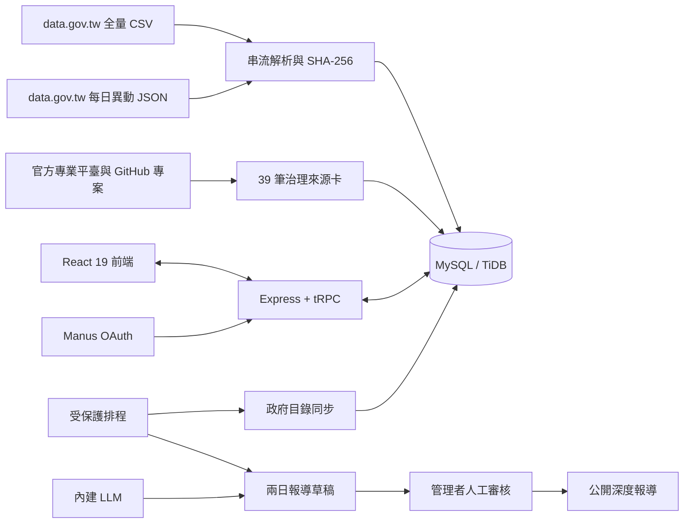

# PiSuAI｜貔貅智慧・臺灣開放資料與深度報導平台

[](https://opendataset.manus.space/)
[](https://kuohuafan.github.io/pisuai-open-data-backup/)


**PiSuAI｜貔貅智慧**是一個以來源追溯、權利分級與人工發布閘門為核心的臺灣開放資料平台。系統將政府資料開放平臺的全國資料目錄轉化為可搜尋索引，同時維護一層經人工判讀的官方與民間來源庫。平台也能依已核准來源產生具引用的深度報導草稿，但不允許 AI 跳過人工審核直接發布。

完整全端網站：[https://opendataset.manus.space/](https://opendataset.manus.space/)

GitHub Pages 專案介紹：[https://kuohuafan.github.io/pisuai-open-data-backup/](https://kuohuafan.github.io/pisuai-open-data-backup/)

> **核心原則：來源可追、版本可核、權利先行、錯誤可改。** 收錄 metadata 不表示 PiSuAI 已驗證每筆原始資料，也不表示資料可以不受限制地重新利用。

## 目前規模

以下數字來自 2026 年 9 月 15 日的官方全量快照與專案驗證紀錄。政府資料集會隨上游目錄持續變動。[1]

| 項目                | 已驗證結果 |
| ------------------- | ---------: |
| 政府資料集 metadata |  53,169 筆 |
| 唯一 datasetId      |  53,169 個 |
| 提供機關標籤        |     800 個 |
| 政府服務分類        |      18 類 |
| 人工治理來源卡      |      39 筆 |
| 治理來源類別        |      20 類 |
| 自動化測試          |  16 項通過 |

詳細驗證過程見 [`government-catalog-qa.md`](./government-catalog-qa.md)，已查核的政府資料入口與同步限制見 [`government-data-source-map.md`](./government-data-source-map.md)。

## 為什麼採兩層資料架構

PiSuAI 不把「出現在政府目錄」與「已完成法律及資料治理審查」混為一談。因此，平台將內容分成兩個層次。

| 層次             | 用途                                                                              | 公開判斷                                        |
| ---------------- | --------------------------------------------------------------------------------- | ----------------------------------------------- |
| **政府資料全集** | 保存 data.gov.tw 的資料集名稱、機關、格式、欄位、更新頻率、授權、官方頁與資源連結 | metadata 可搜尋；實際使用仍須回到原始資料與授權 |
| **治理來源庫**   | 保存官方專業平臺、地方資料平臺及重要民間開源專案的查核卡                          | 逐來源記錄權利分級、風險、顯名方式及公開政策    |

這個設計使平台可以提供廣泛的資料發現能力，同時避免對敏感資料、第三人內容或混合授權作過度概括。

## 主要功能

| 模組         | 功能                                                                         |
| ------------ | ---------------------------------------------------------------------------- |
| 政府資料全集 | 多關鍵字搜尋、服務分類篩選、分頁瀏覽、資料集詳情與官方資源導流               |
| 來源治理     | Canonical URL、GitHub repository、commit SHA、資料授權、程式碼授權及風險說明 |
| 五級權利分級 | A 可公開再利用、B 僅索引與導流、C 限內部使用、D 另取授權、MIXED 逐欄審查     |
| 每日同步     | 全量 CSV 串流匯入、前一日 JSON 異動同步、datasetId 去重、雜湊與下架保留      |
| 深度報導     | 依已核准來源產生具引用草稿；證據不足時採安全降級，不自動發布                 |
| 會員功能     | Manus OAuth 登入、來源收藏及報導收藏                                         |
| 治理後台     | 來源狀態、權利級別、公開範圍、報導核准、管線紀錄與同步操作                   |
| 稽核能力     | 記錄資料同步結果、來源變更與管理者操作                                       |

## 系統架構



前端只透過型別安全的 tRPC 程序讀寫資料。排程端點使用 cron 身分驗證與 task UID 綁定，並設置六小時冪等窗口。正式資料庫、OAuth 憑證及模型金鑰不進入 Git repository。

## 技術棧

| 範圍     | 技術                                                                |
| -------- | ------------------------------------------------------------------- |
| 前端     | React 19、Vite 7、Tailwind CSS 4、shadcn/ui、Wouter、TanStack Query |
| API      | Express 4、tRPC 11、Zod 4、SuperJSON                                |
| 資料庫   | MySQL／TiDB、Drizzle ORM、Drizzle Kit                               |
| 驗證     | Manus OAuth、角色分級 `user`／`admin`                               |
| 資料管線 | `csv-parse` 串流解析、SHA-256、批次 upsert、每日異動同步            |
| AI 報導  | Manus 內建 LLM，來源約束提示與人工發布閘門                          |
| 品質     | TypeScript、Vitest、正式 production build、桌機與手機視覺驗證       |

## 本機啟動

### 必要環境

請使用 **Node.js 22**、**pnpm 10**，並準備一個 MySQL 8 相容或 TiDB 資料庫。Manus OAuth 與內建模型功能需要相應的應用程式環境變數。

```bash
git clone https://github.com/KuohuaFan/pisuai-open-data-backup.git
cd pisuai-open-data-backup
corepack enable
pnpm install
```

接著在本機建立不納入版本控制的 `.env`，填入下一節所列的環境變數。完成後，套用既有 migration 並匯入治理來源卡：

```bash
pnpm exec drizzle-kit migrate
pnpm exec tsx scripts/seed.ts
pnpm dev
```

開發伺服器預設使用 `http://localhost:3000`。請勿把 `.env`、資料庫備份或 OAuth 憑證提交到 Git。

## 環境變數

| 變數                     | 用途                       | 必要性       |
| ------------------------ | -------------------------- | ------------ |
| `DATABASE_URL`           | MySQL／TiDB 連線字串       | 必要         |
| `JWT_SECRET`             | Session cookie 簽章        | 必要         |
| `VITE_APP_ID`            | Manus OAuth 應用程式 ID    | 登入功能必要 |
| `OAUTH_SERVER_URL`       | OAuth 伺服器網址           | 登入功能必要 |
| `VITE_OAUTH_PORTAL_URL`  | 前端登入入口               | 登入功能必要 |
| `OWNER_OPEN_ID`          | 初始管理者 Open ID         | 後台必要     |
| `OWNER_NAME`             | 站台擁有者顯示名稱         | 建議         |
| `BUILT_IN_FORGE_API_URL` | Manus 內建服務入口         | AI 功能必要  |
| `BUILT_IN_FORGE_API_KEY` | Manus 內建服務伺服器端金鑰 | AI 功能必要  |

本機 `.env` 已由 `.gitignore` 排除。正式機密應由部署平台的 secret manager 管理。

## 建立政府資料全集

### 全量匯入

官方全量目錄採 CSV 匯出。系統使用 RFC 4180 相容的串流 parser，並依 datasetId 批次 upsert。部分官方欄位可能超過 64 KB，因此 description、field description、下載連結及備註使用 `MEDIUMTEXT` 保存。

```bash
curl -L 'https://data.gov.tw/api/v2/rest/dataset/export' \
  -o /tmp/data-gov-tw.csv

pnpm exec tsx scripts/syncGovernmentCatalog.ts \
  full /tmp/data-gov-tw.csv
```

### 每日異動

每日異動檔只接受明確標示為「資料集上架」、「資料集修改」或「資料集下架」的紀錄。缺少變動狀態的列會被排除，空欄位也不會覆蓋全量快照中既有的完整 metadata。

```bash
pnpm exec tsx scripts/syncGovernmentCatalog.ts \
  delta 2026-09-15
```

同步結果會寫入 `government_catalog_syncs`。重播同一份異動檔時，雜湊及狀態相同的紀錄不會再次被計為變更。

## 排程與發布閘門

系統提供兩個受保護的排程端點：

| 端點                                           | 預定用途                       | 安全控制                                      |
| ---------------------------------------------- | ------------------------------ | --------------------------------------------- |
| `POST /api/scheduled/sync-government-catalog`  | 每日同步前一日政府資料異動     | Cron 身分、task UID、啟用狀態及六小時冪等窗口 |
| `POST /api/scheduled/generate-biennial-report` | 每 48 小時建立一則深度報導草稿 | 只建立待審草稿，不可直接公開                  |

這些端點不是公開 webhook。正式啟用時，必須由部署平台的受驗證排程服務呼叫，並把 task UID 寫入 `automation_configs`。

## 資料治理與權利邊界

政府資料開放平臺目錄中的資料集授權並不完全相同。即使多數資料採政府資料開放授權條款第 1 版，仍可能存在 CC0、CC BY、CC BY-SA、OFL、付費內容、需申請服務或第三人權利。[2] 因此，PiSuAI 逐筆保存原授權，不把程式碼授權延伸到上游資料。

裁判、醫療、政治獻金、公司關係、不動產交易與行政裁罰等內容具有較高的個資、名譽或再識別風險。這些來源預設採索引、導流或逐欄審查，不因資料由政府機關提供就推定可以無限制散布。司法院、TDX 與智慧財產局等專業平臺也各有會員、速率、附件或使用條件。[3] [4] [5]

## 測試與品質檢查

```bash
pnpm test -- --run
pnpm check
pnpm build
```

目前測試涵蓋 OAuth 登出、首頁 SEO 限制、擴充來源唯一性、政府專業來源治理、資料欄位正規化、下架狀態、臺北時區日期計算及報導安全降級。最近一次驗證為 **6 個測試檔、16 項測試全部通過**，TypeScript 檢查與 production build 亦通過。

## 專案結構

```text
client/src/
  components/              共用版型、資料卡及 UI 元件
  pages/                   首頁、資料全集、來源庫、報導、收藏與後台
server/
  _core/                   OAuth、tRPC、環境、儲存與 Manus 服務整合
  routers/                 government、sources、reports、member、admin
  db.ts                    Drizzle 查詢與資料操作
  governmentCatalog.ts     全量及每日異動同步
  reportGenerator.ts       來源約束的報導草稿生成
  scheduled.ts             受保護排程端點
drizzle/
  schema.ts                資料模型
  0000...0003.sql          已審查 migration
scripts/
  seed.ts                  治理來源與自動化設定
  syncGovernmentCatalog.ts 政府目錄同步 CLI
  expandedSources.ts       擴充官方及開源來源
  governmentSpecializedSources.ts
shared/                    前後端共用常數與型別
```

## 備份與部署

本 repository 是私人 GitHub 原始碼備份。它包含程式碼、migration、治理來源定義與驗證文件，但**不包含正式資料庫內容、環境變數、OAuth 憑證或模型金鑰**。全國政府 metadata 可由官方全量匯出及同步程式重建。

正式網站部署在 Manus WebDev。部署時應由平台注入 secrets，先套用 migration，再執行 `scripts/seed.ts`。首次建立政府資料全集時才需要執行全量匯入；之後使用每日異動同步即可。

## 貢獻方式

新增來源時，請同時提供 canonical URL、實際提供機關、資料取得方式、資料與程式碼授權、更新週期、風險說明及顯名方式。Pull request 不應包含抓取來的完整敏感資料、未去識別的個人資料、付費內容或無法確認權利來源的附件。

若修改資料表，請先執行 `pnpm drizzle-kit generate`，審查 migration SQL，再套用到資料庫。任何可能刪除或重寫既有資料的 migration 都應另行說明資料影響與復原方法。

## 授權

`package.json` 目前將本專案程式碼標記為 **MIT**。在 repository 對外公開前，應另行加入正式 `LICENSE` 文件。政府資料、民間資料、附件、圖片與第三方內容仍適用各自的原始授權及使用條件；本專案的程式碼授權不會自動授權這些內容。

## References

[1]: https://data.gov.tw/api/v2/rest/dataset/export "政府資料開放平臺全量資料集目錄匯出"
[2]: https://data.gov.tw/license "政府資料開放授權條款第 1 版"
[3]: https://opendata.judicial.gov.tw/ "司法院資料開放平臺"
[4]: https://tdx.transportdata.tw/ "運輸資料流通服務平臺 TDX"
[5]: https://cloud.tipo.gov.tw/S220/opdata/ "經濟部智慧財產局開放資料專區"
